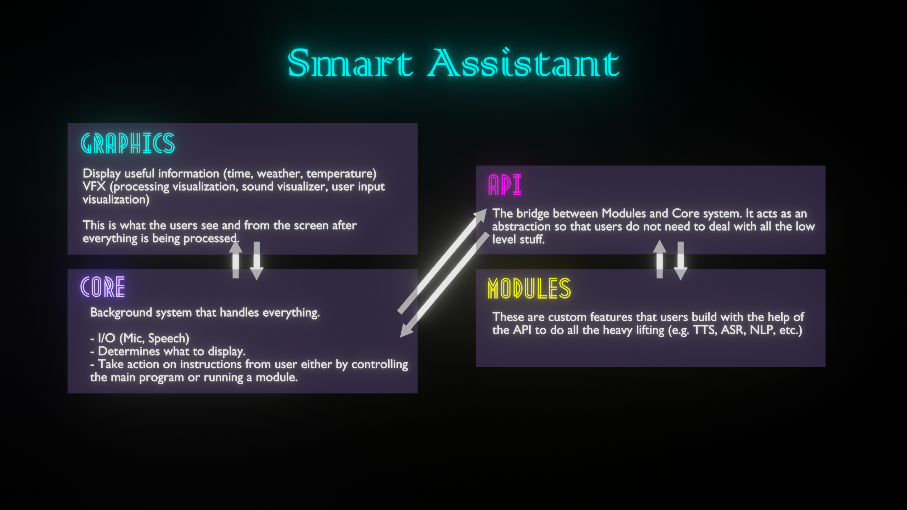

# Smart Assistant

I have created a [YouTube playlist](https://www.youtube.com/watch?v=ncER2nHWTko&list=PLlnBGPe6GFdMxJwR8YXo_GfE1LtnTZfbk) for this project.

This project aims to create a fully functional smart assistant that is able to control your house and automate them. 
You can look at our plan at [Milanote](https://app.milanote.com/1KPrwu1FVZ7S2G?p=UGrY3QR3ztP).
To get more details on what Smart Assistant is, head to our [documentation](https://docs.google.com/document/d/1VVpCAUW7GcWCcOrWAtEkXxx1AH59J9e59fqEaYfNGSw/edit?usp=sharing) and also our [Miro](https://miro.com/welcomeonboard/N49aNY6BBYnq58GVk5gkTm2Vzg7k4OVYFuFsTSrVD7O4zjHOaLg5PMvg2Ut1rYHG) board for a visualization of the whole workflow and process.

Here is an overview of Smart Assistant.

## Table of contents
- [Smart Assistant](#smart-assistant)
  - [Table of contents](#table-of-contents)
  - [Installation](#installation)
  - [Build Settings](#build-settings)
  - [Support the project!](#support-the-project)
  - [Join the community!](#join-the-community)
  - [License](#license)

## Installation

This project depends on several custom packages, all which located in the `Packages` folder. All of these packages exists as a submodule.

1. Do a recursive clone of this repository `git clone --recursive <link>` (clones this repo alongside with all the submodules included).
2. Download all the necessary `unitypackages` and `models` from [Google Drive](https://drive.google.com/drive/u/0/folders/1WOaWVwdCD9p0oq7S3atoJfLt9V0HND1u).
3. You can follow the instructions from all the [sub repositories](./.gitmodules).
4. And you are ready to go!

## Build Settings

- **Unity URP**: 2021.1.(10f1) *you can use any 2021.1 version but keep in mind that you will be changing the source code and out of sync from this repository*

## Support the project!

## Join the community!

## License

Smart Assistant as a whole is licensed under the GNU Public License, Version 3. Individual files may have a different, but compatible license.

See [license file](./LICENSE) for details.
